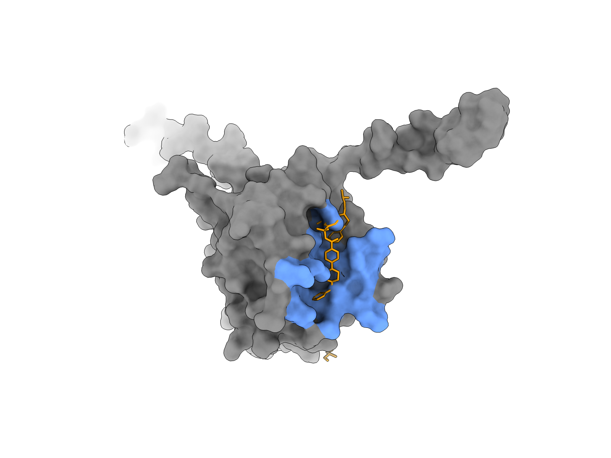

# Introduction

**Cryptic binding pocket discovery via conformational ensemble analysis.**

Most protein structure predictors (AlphaFold, Boltz, Chai) give you one static structure. But ~70% of disease-relevant proteins are considered "undruggable" not because they're biologically intractable - it's because no pocket is visible in their ground state. K-Ras was "undruggable" for 30 years until a transient cryptic pocket was found in its switch-II region. That pocket now backs sotorasib and adagrasib.

Lacuna finds those pockets. It generates a conformational ensemble from any input structure, detects pockets per conformer, and clusters them across the ensemble to surface sites that only appear transiently - ranked by a continuous crypticity score.

```
lacuna discover kras.pdb --conformers 20 --emit-boltz-constraints --emit-vina-boxes
```

<p align="center">
  
</p>

<p align="center"><em>Apo BCL-XL (1LXL): the pocket Lacuna detects and ranks first (blue) sits exactly where the inhibitor ABT-737 (orange, from the holo structure 2YXJ) binds, a site never shown to the detector.</em></p>

---

## Install

```bash
pip install lacuna-pockets
```

**Optional backends** (better conformational sampling):
```bash
pip install "lacuna-pockets[openmm]"   # 100ps implicit-solvent MD
pip install "lacuna-pockets[boltz]"    # Boltz-2 diffusion sampling (experimental, GPU)
pip install "lacuna-pockets[all]"      # everything
```

Requires Python 3.10+.

---

## Quick start

### CLI

```bash
# Discover pockets with defaults (NMA backend - physically grounded, no GPU needed)
lacuna discover protein.pdb --conformers 20

# Filter and limit output
lacuna discover protein.pdb --min-druggability 0.5 --min-persistence 0.3 --top 5

# Analyze a homodimer - detects pockets at the dimer interface (e.g. Caspase-1, IDH1)
# Reads BIOMT records from PDB; for best results use the biological assembly download from RCSB
lacuna discover protein.pdb --homodimer --conformers 20

# Optional Boltz-2 backend (experimental - see the Backends note)
lacuna discover protein.pdb --backend boltz --conformers 30

# Emit all docking file formats
lacuna discover protein.pdb --emit-boltz-constraints --emit-vina-boxes --emit-pocket-pdbs

# Generate docking files from a previous report
lacuna dock-prep kras_lacuna/pocket_report.json kras.pdb --format all
```

### Python API

```python
from lacuna import load_structure, detect_pockets, cluster_pockets
from lacuna.ensemble.nma_backend import NMABackend
from lacuna.io.structure import coords_array
from lacuna.io.writers import write_report, write_boltz_constraint

structure = load_structure("protein.pdb")
backend = NMABackend(seed=42)
coord_sets = backend.generate("protein.pdb", n_conformers=20)

all_coords = [coords_array(structure)] + coord_sets
pocket_lists = []
for ci, coords in enumerate(all_coords):
    pockets = detect_pockets(coords, structure)
    for p in pockets:
        p.conformer_idx = ci
    pocket_lists.append(pockets)

clusters = cluster_pockets(pocket_lists, n_conformers=len(all_coords))
for c in clusters[:5]:
    print(f"Rank {c.rank}  druggability={c.druggability:.3f}  "
          f"persistence={c.persistence:.0%}  cryptic={c.cryptic}")
    print(f"  Residues: {', '.join(c.lining_residues[:5])}")
```

---

## How it works

1. **Ensemble generation** - Generate N conformers via elastic network model normal mode analysis (built-in, default), OpenMM implicit-solvent MD, or experimental Boltz-2 diffusion sampling
2. **Pocket detection** - Grid-based alpha-point analysis per conformer: compute distance transform, find local maxima within the 1.4-5.5 Å interaction zone, cluster nearby alpha-points into pocket candidates
3. **Cross-ensemble clustering** - Greedy centroid merging clusters corresponding pockets across all conformers
4. **Druggability scoring** - Gaussian volume reward centered at 300 ų + enclosure + hydrophobicity + aromaticity (Halgren 2009), scored in each conformer
5. **Crypticity scoring & ranking** - Each site gets a continuous crypticity score (how much it opens relative to the apo state × druggability when open) and is flagged `cryptic: true` if present in <90% of conformers. Pockets are ranked by crypticity by default; `--rank-by druggability` is available for always-open / orthosteric sites

---

## Outputs

| File | Description |
|------|-------------|
| `pocket_report.json` | Ranked pocket metadata: centroid, volume + apo→open range, druggability, crypticity, persistence, lining residues |
| `pocket_N_site.pdb` | Pseudoatom PDB for PyMOL/ChimeraX visualization |
| `pocket_N_constraint.yaml` | Boltz YAML - add a SMILES and run `boltz predict` to dock into this site |
| `pocket_N_vina.conf` | AutoDock Vina / Gnina / QuickVina box config |

---

## Backends

| Backend | Install | Quality | Speed | Notes |
|---------|---------|---------|-------|-------|
| `nma` | built-in | good | ~0.1s/conf | Anisotropic Network Model normal mode analysis - hinge bending, breathing, twist motions |
| `openmm` | `lacuna[openmm]` | good | ~2s/conf | 100ps Langevin MD, GBn2 implicit solvent |
| `boltz` | `lacuna[boltz]` | experimental | ~100s/protein (GPU) | Boltz-2 diffusion sampling from sequence; high diversity but noisy (see note) |
| `random` | built-in | baseline | ~0.04s/conf | Correlated Gaussian backbone perturbation |

**Auto-selection order:** `boltz` → `openmm` → `nma` → `random`. On a plain `pip install lacuna`, the NMA backend runs automatically.

The `nma` backend samples physically meaningful collective motions - the same hinge-bending and breathing modes that open cryptic pockets in nature - without requiring a GPU or force field. It is the zero-dependency default.

> **Boltz backend status (honest note).** The `boltz` backend runs Boltz-2 diffusion sampling on a GPU, but it currently predicts each conformer *de novo from sequence* (not partial diffusion from the input structure), which yields structurally divergent, noisy ensembles (150-300+ pocket clusters vs NMA's ~35). In GPU benchmarking it did **not** reliably improve cryptic detection over NMA. A proper apo-templated integration with sequence-based residue mapping is planned; until then, NMA is the recommended backend.

---

## Benchmarks

**7 / 22 cryptic pockets localized (32%, size-robust criterion; NMA backend, crypticity ranking, 20 conformers).**

This curated result is cross-validated on two further independent datasets - **PocketMiner 31%** and **CryptoBench 18%** (the largest and hardest) - see [Independent validation](#independent-validation--three-benchmarks) below.

**Size-robust success criterion (top-5 pockets):** a pocket whose lining residues reach a **Jaccard overlap ≥ 0.25** with the known ligand-contact site (Jaccard = |found ∩ known| / |found ∪ known|), **or** whose center is within 4 Å of the site centroid. Lining residues use a true atomic-contact definition (any residue with an atom within 5 Å of the detected cavity). Reproduce with `python benchmarks/cryptic_benchmark.py --category cryptic`.

> **Why the number is lower than you may have seen before - please read.** Earlier releases led with plain **recall** (|found ∩ known| / |known| ≥ 30%), which gave **13/22 (59%)** but is *size-gameable*: a large pocket engulfs a small known site and scores high recall while sitting nowhere near it. A learned re-ranker confirmed this by reaching 84% on recall purely by ranking pockets on raw volume. The headline now leads with **size-robust** Jaccard (or a ≤4 Å centroid hit) instead, which roughly halves the numbers but is the one we can defend on held-out data; only 2/22 pass the strict centroid test alone. Both criteria print side by side in every benchmark script.

### Cryptic pockets - 7 / 22 (32%)

The remaining gap is mostly sampling, not ranking: at top-20 the size-robust score only rises to 10/22, so 12 of the misses are never localized at all rather than found-but-mis-ranked. The hard cases split into oligomeric-interface pockets (invisible to single-chain analysis, partly addressable with `--homodimer`) and large-rearrangement sites that need sampling beyond elastic-network modes.

**[Full 22-target breakdown, per-target Jaccard/recall/rank →](docs/BENCHMARKS.md#cryptic-pockets-full-22-target-breakdown)**

### Independent validation - three benchmarks

Measured on three independent datasets (NMA + crypticity, top-5). Both criteria are reported: the **size-robust** headline (Jaccard ≥ 0.25 **or** ≤ 4 Å centroid) and the **legacy recall** number (≥ 30% recall **or** ≤ 4 Å centroid) that earlier releases led with.

| Benchmark | N | Size-robust | Legacy recall | Notes |
|-----------|--:|:-----------:|:-------------:|-------|
| Curated apo/holo set (this repo) | 22 | **32%** | 59% | literature cryptic pairs |
| PocketMiner (Meller 2023, *Nat. Commun.*) | 45 | **31%** | 60% | per-residue cryptic labels |
| CryptoBench test fold (Vavra 2024, *Bioinformatics*) | 180 | **18%** | 49% | largest & most diverse; harder |
| CryptoBench train folds (generalization check) | 749 | **13%** | 50% | brand-new pockets, held out from all tuning |

The two curated/field-standard sets converge at ~31-32% under the size-robust metric; **CryptoBench** - the field's largest cryptic set (1107 structures; 180 of its 222-structure held-out test fold evaluated here) - is harder at **18%**. The legacy recall column roughly doubles every number: that gap is the size-gaming headroom the recall metric leaves open (a large pocket covers a small known site without being localized on it), which is exactly why the size-robust number is the one we lead with.

**Generalization.** To check that these numbers are not an artifact of the specific test fold, we scored all 749 CryptoBench *train*-fold structures, which were never used in any tuning: **13%** size-robust (95% CI 10-16%) and 50% legacy. Both are statistically consistent with the test fold (overlapping confidence intervals), so the honest headline holds up on genuinely unseen pockets. Reproduce (each script prints both criteria):

```bash
python benchmarks/pocketminer_benchmark.py    # PocketMiner (auto-downloads)
python benchmarks/cryptobench_benchmark.py    # CryptoBench test fold (auto-downloads, ~10 min)
```

### Limitations and scaling (this ceiling is a compute problem)

The honest ceiling above (about 32% on the curated set, 13 to 18% on CryptoBench under the size-robust metric) is set by **conformational sampling**, not by ranking or pocket detection. At a top-20 cutoff the numbers rise only slightly, which means the pocket is usually not found-but-mis-ranked; it is simply never sampled in an open state.

The remaining misses concentrate in the **large-collective-motion classes**, hinge and oligomeric-interface openings. The default NMA backend is harmonic and cannot generate those motions. Molecular dynamics can in principle, but a cryptic opening is a **rare event**: in our tests, short trajectories (0.5 to 3 ns) essentially never caught one, and enhanced-temperature MD, metadynamics along an apo-derived collective variable, and SWISH scaled-water MD were all null at the sampling a single workstation affords (see `benchmarks/experiments/`).

Raising this ceiling is a **compute problem, not a missing algorithm**. Reliably observing rare openings needs orders of magnitude more MD sampling: tens to hundreds of nanoseconds per trajectory across dozens of independent replicas, aggregating microseconds per target, the scale used by the successful literature (for example PocketMiner's ~940,000 simulation windows and Folding@home-style datasets). As an anchor, the development GPU runs a small protein at roughly 300 ns/day; sampling rare openings across the 22 to 885 benchmark targets, with the frontier proteins several times slower, is tens to hundreds of GPU-days. **That is cluster or cloud GPU scale.** With that budget, the same pipeline could be driven by long multi-replica MD (or cosolvent MD) to attack the hinge and interface classes that are out of reach on a single machine.

Crypticity ranking (the default) intentionally de-prioritizes always-open sites; for orthosteric / general pocket finding use `--rank-by druggability` (orthosteric controls: [3/6 →](docs/BENCHMARKS.md#orthosteric--conformational-controls), a known relative weakness of this tight-contact pipeline).

### Crypticity score

Every reported pocket carries a continuous **crypticity score** in [0, 1] - the conformational-selection signature of a cryptic site, defined as how much the pocket opens relative to the apo/input structure × how druggable it is once open:

```
opening    = (max_volume − apo_volume) / max_volume        # 1.0 if absent in the apo state
crypticity = opening × peak_open_state_druggability
```

A constitutive pocket already formed in the input structure scores ≈ 0; a pocket absent in the apo structure that opens into a druggable cavity scores near 1. Ranking by crypticity is the **default** and recovers the most cryptic targets. The JSON report also includes per-pocket volume dynamics (`apo_volume_A3`, `volume_range_A3`) and `max_druggability`.

`--rank-by` selects how pockets are ordered: `crypticity` (default, most cryptic sites first, 12/20 cryptic pass), `druggability`, `balanced`, or `persistence`. NMA runtime is sub-second to ~8s per protein on a laptop CPU, no GPU required. **[Full ranking-strategy ablation and per-size timing →](docs/BENCHMARKS.md#ranking-strategies)**

### Head-to-head: Lacuna vs fpocket

fpocket detects pockets on a single static structure. Lacuna generates a conformational ensemble to expose sites that only become visible once the protein moves. Run side by side on the same structures under the same size-robust criterion (top-5, Jaccard ≥ 0.25 or centroid ≤ 4 Å), the two tools catch largely different pockets:

| Set | fpocket | Lacuna | **Combined (either)** |
|-----|:-------:|:------:|:----------------------:|
| CryptoBench test fold (n=180) | 28% (51/180) | 16% (29/180) | **38% (68/180)** |
| Curated cryptic set (n=22) | 18% (4/22) | 18% (4/22) | **36% (8/22)** |

On CryptoBench, Lacuna independently recovers **17 pockets that fpocket misses entirely**: sites invisible to single-structure geometric detection that only open once the ensemble samples them. On the curated set, the hit lists don't overlap at all: fpocket catches T4 lysozyme's buried cavity and PTP1B's allosteric site, while Lacuna catches the BCL-2/BCL-XL BH3 grooves, MDM2's p53-binding cleft, and IL-2's helix pocket, sites that open through conformational change rather than being present in one fixed geometry. Running both and taking the union beats either tool alone on both benchmarks.

> **Reproduce:**
> ```bash
> python benchmarks/compare_fpocket.py                            # 22 curated cryptic targets vs fpocket
> python benchmarks/compare_fpocket_cryptobench.py --folds test   # CryptoBench test fold vs fpocket (~7 min)
> python benchmarks/cryptic_benchmark.py --category cryptic       # 22 cryptic targets, NMA (~4 min)
> python benchmarks/cryptic_benchmark.py --quick                  # 10 conformers, faster
> python benchmarks/cryptic_benchmark.py --category cryptic --rank-by druggability  # ablation
> python benchmarks/cryptic_benchmark.py --category cryptic --top-n 20              # detection ceiling
> ```

---

## Example: K-Ras switch-II

```bash
# Download K-Ras apo (from RCSB); NMA backend (default) recovers switch-II at rank 3
lacuna discover 4OBE.pdb \
    --conformers 20 \
    --emit-boltz-constraints \
    --output kras_pockets/

# pocket_0_constraint.yaml is ready - add your SMILES:
#   - ligand:
#       id: L
#       smiles: YOUR_SMILES_HERE
boltz predict kras_pockets/pocket_0_constraint.yaml
```

See [`examples/kras_cryptic.py`](examples/kras_cryptic.py) for a full annotated Python workflow.

---

## Input formats

Accepts PDB or mmCIF from any predictor or database:
- AlphaFold 2 / AlphaFold 3
- Boltz-1 / Boltz-2
- Chai-1
- RCSB PDB
- ESMFold, RoseTTAFold, OpenFold, etc.

---

## Citation

If you use Lacuna in published research, please cite:

> Moore, C. (2026). *Lacuna: Cryptic Binding Pocket Discovery via Conformational Ensemble Analysis.* https://github.com/mooreneural/lacuna

**BibTeX:**
```bibtex
@software{moore2026lacuna,
  author  = {Moore, Clayton W.},
  title   = {Lacuna: Cryptic Binding Pocket Discovery
             via Conformational Ensemble Analysis},
  year    = {2026},
  url     = {https://github.com/mooreneural/lacuna},
  version = {0.2.0}
}
```

**Methodology papers Lacuna builds on:**

- Atilgan et al. (2001) *Biophys. J.* 80(1):505-515 - Anisotropic Network Model (NMA backend)
- Halgren (2009) *J. Chem. Inf. Model.* 49(2):377-389 - SiteMap druggability scoring
- Le Guilloux et al. (2009) *BMC Bioinformatics* 10:168 - fpocket alpha-sphere approach
- Schmidtke & Barril (2010) *J. Med. Chem.* 53(15):5858-5867 - enclosure scoring

---

## License

**[GNU AGPL-3.0-or-later](LICENSE)** - free to use, study, modify, and share.
The AGPL's copyleft requires that if you distribute a modified version, **or run
a modified version as a network/hosted service**, you make the complete
corresponding source available under the same license.

A separate **[commercial license](LICENSE_COMMERCIAL)** removes the AGPL
copyleft obligation (for embedding Lacuna in closed-source products or hosted
services without releasing your own source) and adds warranty, indemnification,
support SLAs, and custom development. Contact claytonwaynemoore@gmail.com.

> Versions ≤ 0.1.2 were released under the MIT License and remain available
> under those terms. AGPL-3.0 applies from version 0.2.0 onward.
