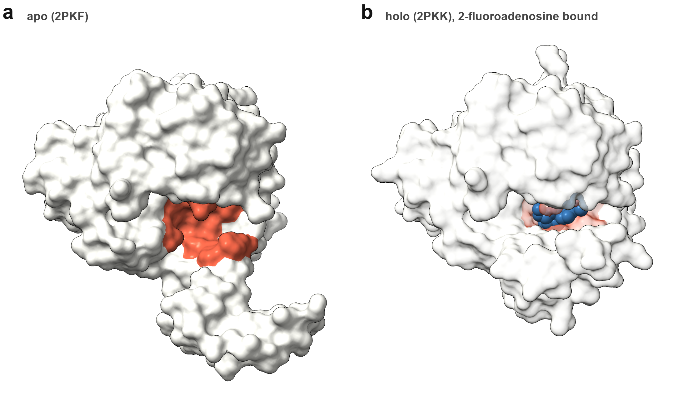
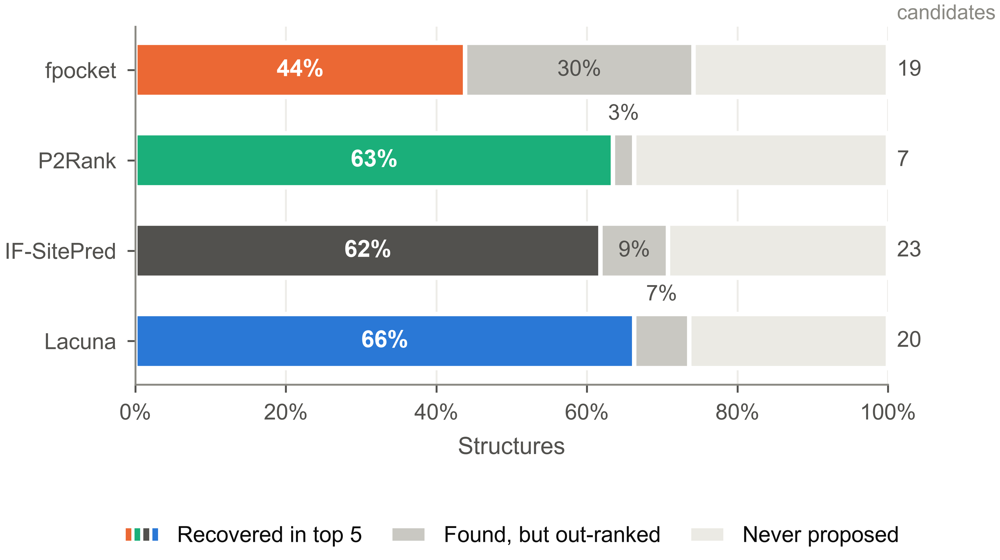
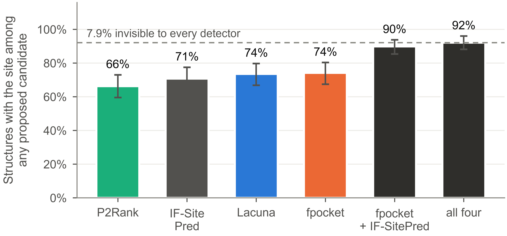
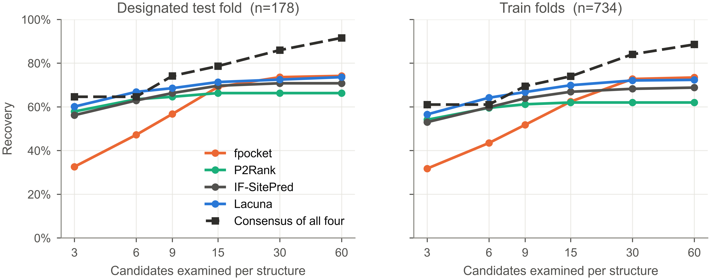
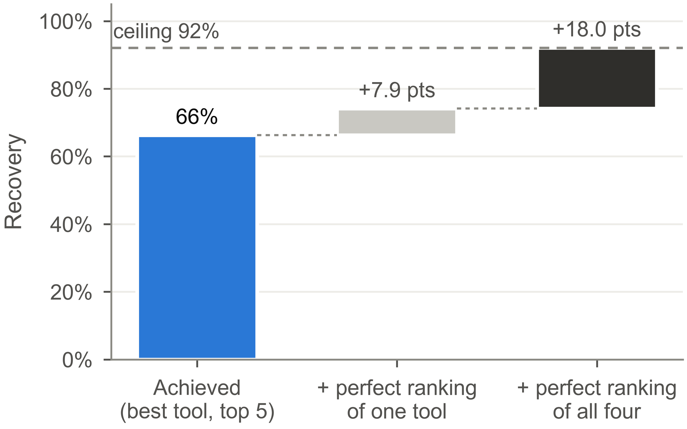

**Keywords:** binding site prediction; cryptic pockets; benchmarking; evaluation
methodology; ensemble methods; CryptoBench

## Abstract

Methods for predicting cryptic binding sites are compared almost exclusively on
top-*n* recovery, a number that conflates two independent abilities: proposing a
candidate at the right location, and ranking it highly enough to be seen. We
separate them by retaining the per-candidate overlap of every proposal, rather
than only the top five, for four structurally different detectors spanning 2009
to 2026, across the CryptoBench benchmark. The separation is large and it
reorders the field. On the designated test fold of 178 structures, fpocket, a purely
geometric method from 2009, proposes a qualifying candidate for 74.2% of targets,
the highest coverage of any tool tested, yet surfaces one in its top five for only
43.8%. P2Rank proposes qualifying candidates for 66.3% and surfaces 63.5%, and
IF-SitePred, a 2024 method built on protein language model embeddings, proposes
70.8% and surfaces 61.8%. Coverage across tools varies by 8 points while
conversion, the share of a tool's own coverage that reaches the top five, varies
from 59% to 96%. Unioning the four detectors reaches 92.1% coverage, and only
7.9% of cryptic sites are invisible to all of them. The field's headroom is
therefore predominantly in ranking and in combination, not in detection: perfect
ranking of a single tool's existing proposals would reach 74.2%, and of the union
92.1%, against the 66.3% currently achieved. We show the practical consequence is governed by candidate budget.
Added coverage converts to recovery at about 85% while a structure carries fewer
than roughly fifteen candidates and at about 51% above it, which explains a
series of interventions that raised coverage and returned nothing. Working within
that budget, proposing pockets from a protein language model at locations where
geometry finds no concavity improves single-structure recovery by 8.5% (95% CI
+4.0 to +13.6) on test-fold data, and lets a five-conformer ensemble match a
twenty-conformer one at a third of the wall clock. We release per-candidate
overlaps for all tools so that coverage and conversion can be reported separately
without re-running any method.

## Introduction

A cryptic binding site is one that is not apparent in a protein's unbound
structure and opens only on ligand binding or thermal fluctuation (Figure 1). Because the
apo structure frequently contains no open cavity at the site, cryptic sites are
the hardest case for binding site prediction and the most valuable, since they
expand the set of proteins considered druggable [9].

Progress is measured almost entirely by top-*n* recovery: the fraction of targets
for which a qualifying pocket appears within a method's first *n* proposals,
usually with *n* = 1, 3, or 5 [3,5,6,8]. This single number combines two abilities that
have no necessary relationship. A method must first propose a candidate that
overlaps the true site, and must then rank that candidate above its own
alternatives. A method that proposes well and ranks poorly is
indistinguishable, under top-*n*, from one that never proposes the site at all.

**Figure 1. A cryptic site that every detector finds and only one ranks.**
*Mycobacterium tuberculosis* adenosine kinase in its apo form (2PKF, **a**) and
with 2-fluoroadenosine bound (2PKK, **b**); the eighteen annotated site residues
are red and the ligand is blue. The two structures are the same construct
(UniProt P9WID5, 100% sequence identity). Binding contracts the site modestly:
site residues move 1.25 A on average over a 1.36 A core CA RMSD, and the site's
radius of gyration falls from 8.2 to 7.6 A. In the apo form the site is a shallow
surface groove rather than an enclosed cavity, which is what a geometric detector
scores poorly. Both panels share one
camera, so the difference between them is conformational rather than a change of
view; the holo surface is rendered translucent so the bound ligand is visible.
All four detectors tested propose a qualifying candidate for this structure.
fpocket ranks it 13th of 17 proposals, while P2Rank ranks it 1st and Lacuna 2nd.
Under top-5 recovery, fpocket is scored as having missed this site entirely.

The distinction is not hypothetical. Methods differ enormously in how many
candidates they emit, from fewer than seven to more than twenty per structure,
and a method emitting twenty candidates faces a harder ranking problem at fixed
*n* than one emitting seven, independent of detection quality. Top-*n* silently
penalises the former.

Methods specific to cryptic sites exist, including graph neural networks trained
to flag residues likely to open [6], and the broader problem of predicting a
protein's conformational ensemble from sequence is the subject of active work
[21-23] whose own authors describe it as unsolved and limited by training data
[7]. Both
lines are evaluated by the same top-*n* convention.

Recent assessments of the field have concentrated on thermodynamic accuracy,
asking how well methods predict the probability that a given pocket is open
[1], or have surveyed the landscape narratively [2]. Neither addresses the detection and ranking split, and the
authors of the CryptoBench benchmark note that a systematic comparison of
strengths and limitations in cryptic pocket detection is still lacking
[3].

The reason the split has not been measured is mundane: it requires keeping
information every pipeline discards. Benchmarks record whether a hit occurred
within the top five and throw away everything below. Recovering coverage after
the fact is impossible without re-running every method. We retained the
per-candidate overlap of every proposal, which makes the decomposition a matter
of arithmetic.

## Methods

**Benchmark.** CryptoBench [3] supplies 1,107 apo structures with cryptic site
residues annotated from a holo counterpart, split into homology separated folds
of 222 test and 885 train. Attrition to the analysed set is as follows: 929
structures ran successfully under fpocket and P2Rank, the remainder failing on
structure parsing, chain selection or a residue-count bound; IF-SitePred ran on
914 of those; and requiring every tool to have produced output on a structure, so
that all comparisons are paired, leaves 912. We report the designated test fold
(n = 178) as the primary result and the pooled train folds (n = 734) where a
larger sample aids resolution.

**On the status of the test fold.** No comparator was tuned against it: fpocket,
P2Rank and IF-SitePred are third-party tools run at their published defaults.
Lacuna's ranker was selected by leave-one-fold-out cross-validation over the
train folds only. Lacuna has, however, been developed across many iterations
during which test-fold performance was measured and reported, so its numbers
should be read as less strictly held out than the comparators'. We use
"designated test fold" rather than a claim of full blindness for that reason.
This asymmetry favours Lacuna, and works against the paper's argument only in
that it makes Lacuna's position look better than it is; the coverage and
conversion decomposition does not depend on it.

**Detectors.** Four methods spanning the architectural range and seventeen years:
fpocket 4.2 [4], purely geometric, alpha spheres on a Voronoi tessellation;
P2Rank 2.5.1 [5], a random forest over physicochemical descriptors of solvent
accessible surface points; IF-SitePred [8], which scores residues with a LightGBM
model over ESM-IF1 [12] inverse-folding embeddings and clusters probe points around
the positives; and Lacuna 1.0.0 [24], which generates a normal mode ensemble [13], detects
per conformer, and clusters across the ensemble. All four ran on identical
inputs, single chains as designated by CryptoBench.

**Two adaptations for IF-SitePred**, both recorded because they affect its
numbers. Its released pipeline reports at most three sites per structure, which
would make coverage and top-3 identical by construction and so cannot be used to
measure the quantity this study is about; we removed that cap and kept every
cluster, ranked by cluster size as the method itself ranks them. Its sites are
point clouds rather than residue sets, so a site's residues are taken as those
with any atom within 4.5 A of its points, the same radius the method's own cloud
construction uses to associate probe points with a predicted residue. Its scoring
model, embeddings, clustering parameters and ranking are unchanged.

**Criterion.** A candidate qualifies if the Jaccard index between its lining
residues and the annotated site residues is at least 0.25. Jaccard rather than
recall because recall is trivially gamed by proposing larger pockets: a
sixty-residue proposal covering an eight-residue site scores perfectly on recall
and is useless in practice.

**Sequence-seeded proposals.** The constructive experiment in Section 3.4 adds
candidates at locations a sequence model scores highly, independent of geometry.
Per-residue cryptic-site probabilities come from a two-layer head over ESM-2
650M embeddings [11], fitted on the CryptoBench train folds only. For a given
structure the twenty highest-scoring residues are grouped by single-linkage
clustering of their side-chain centroids at 8 A, groups of fewer than three
residues are discarded as scattered rather than localized, and the three
highest-scoring groups by summed probability become seed centres. Each centre is
described by the same grid geometry that describes a detected pocket, so a seeded
proposal and a detected one carry identical features and are ranked by the same
model without special-casing. Seeding therefore adds at most three candidates per
structure. The evaluation is paired over the 177 test-fold structures on which
both the seeded and unseeded pipelines produced output; because the sequence head
was fitted on the train folds, the train-fold effect (+12.3%) is inflated by
in-sample recognition and only the test-fold figure is reported as the result.

**Metrics.** For each structure and tool we record the ranked list of
per-candidate Jaccards. Coverage (equivalently, the oracle) is the fraction of
structures where any candidate qualifies at any rank. Top-*k* is the fraction
where one qualifies within the first *k*. Conversion is top-5 divided by
coverage: the share of what a tool found that it also surfaced. Confidence
intervals are bootstrap percentiles over structures, 20,000 resamples;
comparisons between tools are paired on structure.

**A note on comparability.** These are pocket-level quantities. Much of the
literature reports residue-level AUC, which asks a different question and is not
comparable to any number here. We make the distinction explicit because the two
are routinely juxtaposed.

## Results

### Coverage varies little between tools; conversion varies enormously

**Table 1. Coverage and conversion by detector.** Designated CryptoBench test
fold, n = 178. Conversion is top-5 divided by coverage: the share of what a tool
found that it also surfaced.

| tool | year | candidates | coverage | top-5 | conversion |
|---|---:|---:|---:|---:|---:|
| fpocket | 2009 | 19.0 | **74.2%** | 43.8% [36.5, 51.1] | 59% |
| P2Rank | 2018 | 6.7 | 66.3% | 63.5% [56.2, 70.2] | **96%** |
| IF-SitePred | 2024 | 23.4 | 70.8% | 61.8% [54.5, 68.5] | 87% |
| Lacuna | 2026 | 20.5 | 73.6% | **66.3%** [59.0, 73.0] | 90% |

Designated test fold, n = 178.

fpocket, the oldest and simplest method tested, has the **highest coverage of the
four** (Table 1, Figure 2). It proposes a qualifying candidate for 74.2% of targets, marginally above
Lacuna's 73.6%, 3.4 points above IF-SitePred's 70.8% and 7.9 points above
P2Rank's 66.3%. Its top-5 recovery is nonetheless the lowest by 18 points,
because it converts only 59% of what it finds. P2Rank achieves nearly the
opposite profile: the least coverage and almost perfect conversion at 96%, from a
candidate set a third the size.

The pattern is not an artefact of older tools. IF-SitePred, published in 2024 and
built on protein language model embeddings, sits inside the same band on both
axes: its coverage is neither the best nor the worst, and its conversion of 87%
falls between fpocket's and P2Rank's. Across four methods spanning seventeen
years and three architectures, coverage varies by 7.9 points and conversion by
37.

**Figure 2. Where each detector's structures go.** For each tool, the share of
test-fold structures recovered within the top five, found but out-ranked, and
never proposed at any rank. The out-ranked band is the quantity top-*n* recovery
hides: it is 30.3 points for fpocket and 2.8 for P2Rank, while the never-proposed
band varies by less than 8 points across all four tools.

Top-5 therefore ranks these tools in almost the reverse order of their detection
ability. A reader of the top-5 column alone would conclude that fpocket fails to
find cryptic sites. It finds them as often as anything else.

Lacuna's advantage over P2Rank at top-5 is 2.8 points with a paired interval of
-4.4 to +9.4, which includes zero. We report the two as at parity.

### Most cryptic sites are already detectable

**Table 2. Union coverage across detector subsets.**

| union | coverage |
|---|---:|
| P2Rank alone | 66.3% |
| IF-SitePred alone | 70.8% |
| Lacuna alone | 73.6% |
| fpocket alone | 74.2% |
| fpocket + Lacuna | 84.8% |
| fpocket + P2Rank | 84.8% |
| fpocket + IF-SitePred | 89.9% |
| **all four** | **92.1%** |

The tools fail on substantially different structures (Table 2, Figure 3). Every pair tested reaches
at least 84%, the best pair reaches 89.9%, and all four together propose a
qualifying candidate for 92.1% of targets. **Only 7.9% of cryptic sites in this
benchmark are invisible to every method tested.**

The best pair is worth noting: fpocket with IF-SitePred reaches 89.9%, within 2.2
points of all four, pairing the oldest geometric method with the newest
sequence-based one. Complementarity here tracks architectural difference rather
than individual quality.

**Figure 3. Coverage as detectors are combined.** Union coverage for selected
subsets of the four tools. No pair falls below 84%, and all four together propose
a qualifying candidate for 92.1% of targets, leaving 7.9% invisible to every
method tested.

Set against 66.3% achieved by the best single tool, this locates the field's
headroom precisely (Figure 5). Perfect ranking of one tool's existing proposals would reach
74.2%. Perfect ranking of the union would reach 92.1%. Improving detection can
contribute at most the residual 7.9%. Stated as counts: of the 60 test-fold
targets the best top-5 result misses, **46 (77%) already have a qualifying
candidate somewhere among the four detectors' proposals, and only 14 (23%) are
proposed by none of them.**

### Added coverage converts only within a candidate budget

The obvious inference, that detectors should simply be combined, is true only
above a candidate threshold, and the same threshold explains a series of
interventions that raised coverage and delivered nothing.

Capping each tool at *m* candidates and comparing the union against the best
single tool at the same total budget (Table 3, Figure 4):

**Table 3. Consensus against the best single tool at matched candidate budget.**

| budget | union | union minus best single |
|---:|---:|---|
| 3 | 64.6% | +4.5% [-0.6, +10.1] |
| 6 | 64.6% | -2.2% [-7.9, +3.4] |
| 9 | 74.2% | +5.6% [+0.0, +11.2] |
| 15 | 78.7% | +7.3% [+1.7, +12.9] |
| 30 | 86.0% | +12.4% [+5.6, +19.1] |
| 60 | 91.6% | +17.4% [+11.8, +23.6] |

Below nine candidates the union is indistinguishable from the best single tool,
and at a budget of six it is nominally worse.
Consensus is not free: it buys coverage by spending candidate budget, and below
that threshold the spend costs more than the coverage returns.

**Figure 4. Recovery against candidate budget.** Union of all four detectors
against the best single tool, as a function of how many candidates per structure
a user is willing to examine. Below nine the two are indistinguishable and at six the union is nominally
worse; the separation emerges at nine, where the interval's lower bound is
exactly zero, and is clearly positive by fifteen. Consensus buys coverage by spending
candidate budget, and below the crossover the spend costs more than it returns.

We measured the same threshold independently (Table 4) by holding an intervention fixed and
varying only candidate count. Sequence-seeded proposals (below) add the same one
to three candidates regardless of ensemble size, so running them across ensemble
sizes isolates candidate count from the intervention itself:

**Table 4. Conversion of added coverage against candidate count**, holding the
intervention fixed and varying only ensemble size. Conversion is computed from
unrounded quantities.

| candidates | coverage gain | top-5 gain | converts |
|---|---:|---:|---:|
| 6.6 to 7.8 | +14.3% | +12.3% | 86% |
| 14.1 to 15.3 | +6.4% | +5.5% | 85% |
| 17.5 to 18.7 | +5.2% | +2.7% | 51% |
| 21.1 to 22.2 | +3.9% | +2.0% | 52% |

Conversion holds near 85% up to roughly fifteen candidates and falls to about
51% above it, a drop of two fifths in relative terms.
This accounts for a set of interventions we and others have tried that raise
coverage and return nothing at top-5: pooling detection scales raised coverage by
21 points and top-5 by zero; lowering the minimum pocket volume raised coverage
and lowered top-5; doubling and quadrupling ensemble size raised coverage to 82%
with top-5 flat. All were run at approximately twenty candidates per structure,
above the threshold, where added coverage does not convert.

### A constructive consequence: proposing from sequence

If candidate budget is the constraint, the useful question is not how to find
more sites but how to spend a fixed budget better. Cryptic sites are precisely
those where an apo structure offers no concavity for a geometric detector, so we
tested proposing candidates at locations a protein language model scores highly,
independent of geometry.

On a single structure, Lacuna's geometric detector covers 46.5% of train-fold
targets and already converts 97.6% of that into top-5: its single-structure
performance is capped by detection, with nothing available from better ranking.
Adding at most three proposals per structure from the highest-scoring residues of
a sequence model raises test-fold top-5 recovery by **8.5% (95% CI +4.0 to
+13.6)**, from 18 structures gained against 3 lost, for 1.2 additional
candidates. The train-fold effect was +12.3%, so approximately a third of the
apparent gain was the sequence model recognising folds it had been fitted on;
the test-fold remainder is what we report.

Because seeding substitutes for conformational sampling rather than complementing
it, a five-conformer ensemble with seeding matches a twenty-conformer ensemble
without it (-0.1%, CI -2.9 to +2.6) at a third of the wall clock. At twenty
conformers seeding adds nothing separable from zero, as the budget threshold
predicts.

## Discussion

Three practical conclusions follow.

**Report coverage and conversion separately.** They are independent abilities,
they vary independently across methods, and a single top-*n* number obscures
both. A method with 74% coverage and 59% conversion needs different work from one
with 66% coverage and 96% conversion, and top-*n* cannot distinguish them. The
per-candidate data required is already computed by every method and merely
discarded.

**Detection is not where the field's headroom is.** Only 7.9% of the sites in
this benchmark are invisible to all four detectors, while 26 points separate the
best achieved top-5 from what perfect ranking of the union would deliver. Effort
spent proposing more candidates is, on this evidence, worth roughly a third of
effort spent ranking existing ones better, and that ratio worsens as candidate
counts rise.

**Figure 5. What the ceiling is, and which part ranking can reach.** Achieved
top-5 recovery, the ceiling from perfectly ranking one tool's existing proposals,
the ceiling from perfectly ranking the union, and the residual that no tested
detector proposes. Roughly three quarters of what is currently missed is already
being proposed and discarded.

**Consensus works, but only above roughly nine candidates.** Below that,
combining detectors is indistinguishable from using the best one, and at a budget
of six it is nominally worse, because the candidate budget spent exceeds the
coverage bought. We state this as a caveat rather than a recommendation because
it inverts below the threshold, and a practitioner who applies consensus at top-3
will see it fail. Where budget allows, the gain is large: at 30 candidates the
consensus is 12.4 points [+5.6, +19.1] above the best single tool.

**Limitations.** Four tools do not span a field with more than forty published
methods [10]. Unevaluated families include 3D convolutional and surface-based
segmentation models [14-17], graph attention networks [18], geometric approaches
other than alpha spheres [19], energy-based probe mapping [20], cryptic-specific
residue predictors such as PocketMiner [6], and ensemble-generation approaches
[21-23]. We evaluated one recent deep learning detector and it behaved like the
others, but a single instance is weak evidence that the pattern holds across that
class, and methods trained with different objectives may distribute differently
across coverage and conversion. IF-SitePred also required two adaptations,
described in Methods, and its measured performance depends on the 4.5 A radius
used to convert its point clouds into residue sets. The candidate budget
threshold is measured on Lacuna's pipeline and its transferability to other
tools' candidate distributions is assumed rather than shown. All results use one
benchmark and one criterion; a different overlap threshold would move the
absolute numbers, though the decomposition is threshold-independent by
construction. Sequence seeding was validated at one conformer on test-fold data,
but the five-conformer equivalence is train-fold only.

## References

1. Zhang S, Miller JJ, Bowman GR. How well can AI and physics-based simulations
   predict the probability a cryptic pocket is open? *Journal of Chemical Theory
   and Computation* 2026;**22**(8):3839-3850. doi:10.1021/acs.jctc.6c00135

2. Zhang S, Bowman GR. Decrypting cryptic pockets with physics-based simulations
   and artificial intelligence. *Current Opinion in Structural Biology*
   2026;**96**:103215. doi:10.1016/j.sbi.2025.103215

3. Škrhák V, Novotný M, Feidakis C, Krivák R, Hoksza D. CryptoBench: cryptic
   protein-ligand binding sites dataset and benchmark. *Bioinformatics*
   2025;**41**(1):btae745. doi:10.1093/bioinformatics/btae745

4. Le Guilloux V, Schmidtke P, Tuffery P. Fpocket: an open source platform for
   ligand pocket detection. *BMC Bioinformatics* 2009;**10**:168.
   doi:10.1186/1471-2105-10-168

5. Krivák R, Hoksza D. P2Rank: machine learning based tool for rapid and accurate
   prediction of ligand binding sites from protein structure. *Journal of
   Cheminformatics* 2018;**10**:39. doi:10.1186/s13321-018-0285-8

6. Meller A, Ward M, Borowsky J, Kshirsagar M, Lotthammer JM, Oviedo F, et al.
   Predicting locations of cryptic pockets from single protein structures using
   the PocketMiner graph neural network. *Nature Communications*
   2023;**14**:1177. doi:10.1038/s41467-023-36699-3

7. Jing B, Berger B, Jaakkola T. AI-based methods for simulating, sampling, and
   predicting protein ensembles. *Current Opinion in Structural Biology*
   2026;**98**:103251. doi:10.1016/j.sbi.2026.103251

8. Carbery A, Buttenschoen M, Skyner R, von Delft F, Deane CM. Learnt
   representations of proteins can be used for accurate prediction of small
   molecule binding sites on experimentally determined and predicted protein
   structures. *Journal of Cheminformatics* 2024;**16**:32.
   doi:10.1186/s13321-024-00821-4

9. Cimermancic P, Weinkam P, Rettenmaier TJ, Bichmann L, Heffron GJ, Rakoczy S,
   et al. CryptoSite: expanding the druggable proteome by characterization and
   prediction of cryptic binding sites. *Journal of Molecular Biology*
   2016;**428**(4):709-719. doi:10.1016/j.jmb.2016.01.029

10. Utgés JS, Barton GJ. Comparative evaluation of methods for the prediction of
    protein-ligand binding sites. *Journal of Cheminformatics* 2024;**16**:126.
    doi:10.1186/s13321-024-00923-z

11. Lin Z, Akin H, Rao R, Hie B, Zhu Z, Lu W, et al. Evolutionary-scale
    prediction of atomic-level protein structure with a language model.
    *Science* 2023;**379**(6637):1123-1130. doi:10.1126/science.ade2574

12. Hsu C, Verkuil R, Liu J, Lin Z, Hie B, Sercu T, et al. Learning inverse
    folding from millions of predicted structures. *bioRxiv* 2022.
    doi:10.1101/2022.04.10.487779

13. Bakan A, Meireles LM, Bahar I. ProDy: protein dynamics inferred from theory
    and experiments. *Bioinformatics* 2011;**27**(11):1575-1577.
    doi:10.1093/bioinformatics/btr168

14. Aggarwal R, Gupta A, Chelur V, Jawahar CV, Priyakumar UD. DeepPocket: ligand
    binding site detection and segmentation using 3D convolutional neural
    networks. *Journal of Chemical Information and Modeling*
    2022;**62**(21):5069-5079. doi:10.1021/acs.jcim.1c00799

15. Mylonas SK, Axenopoulos A, Daras P. DeepSurf: a surface-based deep learning
    approach for the prediction of ligand binding sites on proteins.
    *Bioinformatics* 2021;**37**(12):1681-1690.
    doi:10.1093/bioinformatics/btab009

16. Stepniewska-Dziubinska MM, Zielenkiewicz P, Siedlecki P. Improving detection
    of protein-ligand binding sites with 3D segmentation. *Scientific Reports*
    2020;**10**:5035. doi:10.1038/s41598-020-61860-z

17. Kandel J, Tayara H, Chong KT. PUResNet: prediction of protein-ligand binding
    sites using deep residual neural network. *Journal of Cheminformatics*
    2021;**13**:65. doi:10.1186/s13321-021-00547-7

18. Smith Z, Strobel M, Vani BP, Tiwary P. Graph attention site prediction
    (GrASP): identifying druggable binding sites using graph neural networks with
    attention. *Journal of Chemical Information and Modeling*
    2024;**64**(7):2637-2644. doi:10.1021/acs.jcim.3c01698

19. Gagliardi L, Rocchia W. SiteFerret: beyond simple pocket identification in
    proteins. *Journal of Chemical Theory and Computation* 2023;**19**(15):
    5242-5259. doi:10.1021/acs.jctc.2c01306

20. Kozakov D, Grove LE, Hall DR, Bohnuud T, Mottarella SE, Luo L, et al. The
    FTMap family of web servers for determining and characterizing
    ligand-binding hot spots of proteins. *Nature Protocols*
    2015;**10**(5):733-755. doi:10.1038/nprot.2015.043

21. Jing B, Berger B, Jaakkola T. AlphaFold meets flow matching for generating
    protein ensembles. arXiv:2402.04845, 2024.

22. Lewis S, Hempel T, Jiménez-Luna J, Gastegger M, Xie Y, Foong AYK, et al.
    Scalable emulation of protein equilibrium ensembles with generative deep
    learning. *Science* 2025;**389**:eadv9817. doi:10.1126/science.adv9817

23. Wayment-Steele HK, Ojoawo A, Otten R, Apitz JM, Pitsawong W, Hömberger M,
    et al. Predicting multiple conformations via sequence clustering and
    AlphaFold2. *Nature* 2024;**625**:832-839. doi:10.1038/s41586-023-06832-9

24. Moore CW. Lacuna: cryptic binding pocket discovery via conformational
    ensemble analysis. Zenodo, 2026. doi:10.5281/zenodo.20533638

## Data and code availability

All per-candidate overlaps, the analysis that produces every number above, and
the figure generation code are at <https://github.com/mooreneural/lacuna>,
archived at <https://doi.org/10.5281/zenodo.20533638>. The per-candidate dataset
allows coverage, conversion, and top-*k* at any *k* to be recomputed for all
four tools without re-running any method. Benchmark outputs are released under
CC-BY; the software is MIT.

## Funding

This work received no external funding.

## Author contributions

C.W.M. conceived the study, wrote the analysis and benchmarking code, performed
all experiments, and wrote the manuscript.

## Competing interests

The author develops Lacuna, one of the methods evaluated. Lacuna is released
under the MIT license with no commercial licensing arrangement, so the author has
no financial interest in its adoption. No other competing interests.
