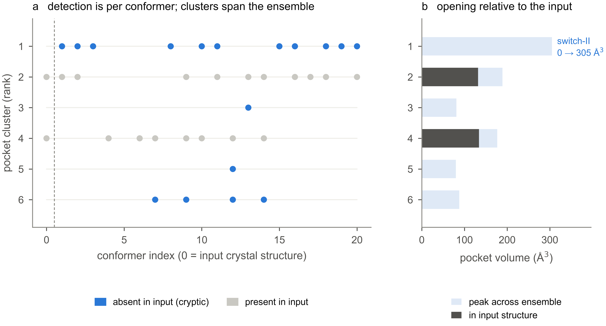
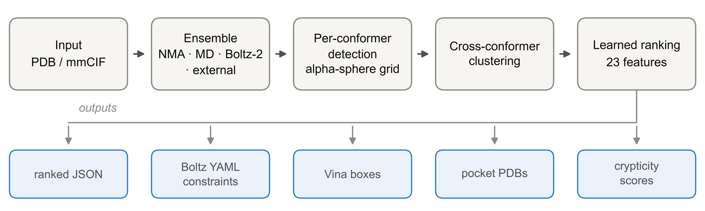
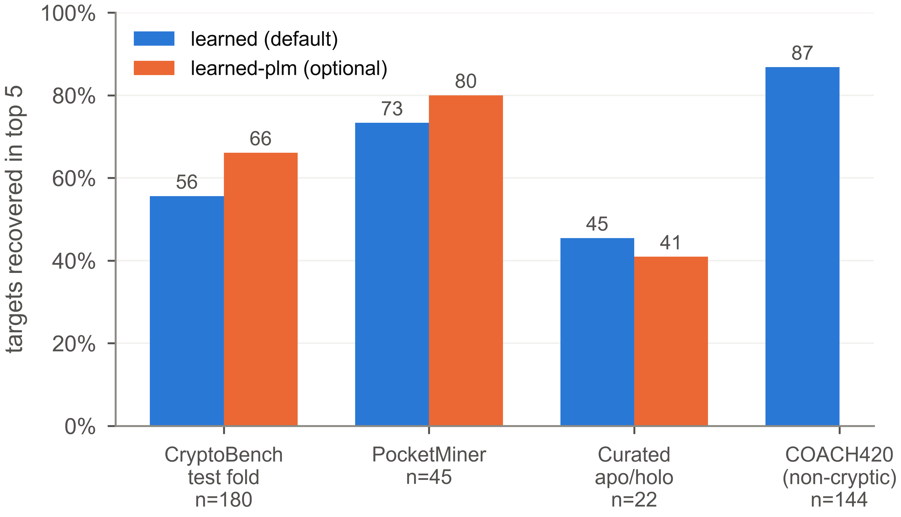
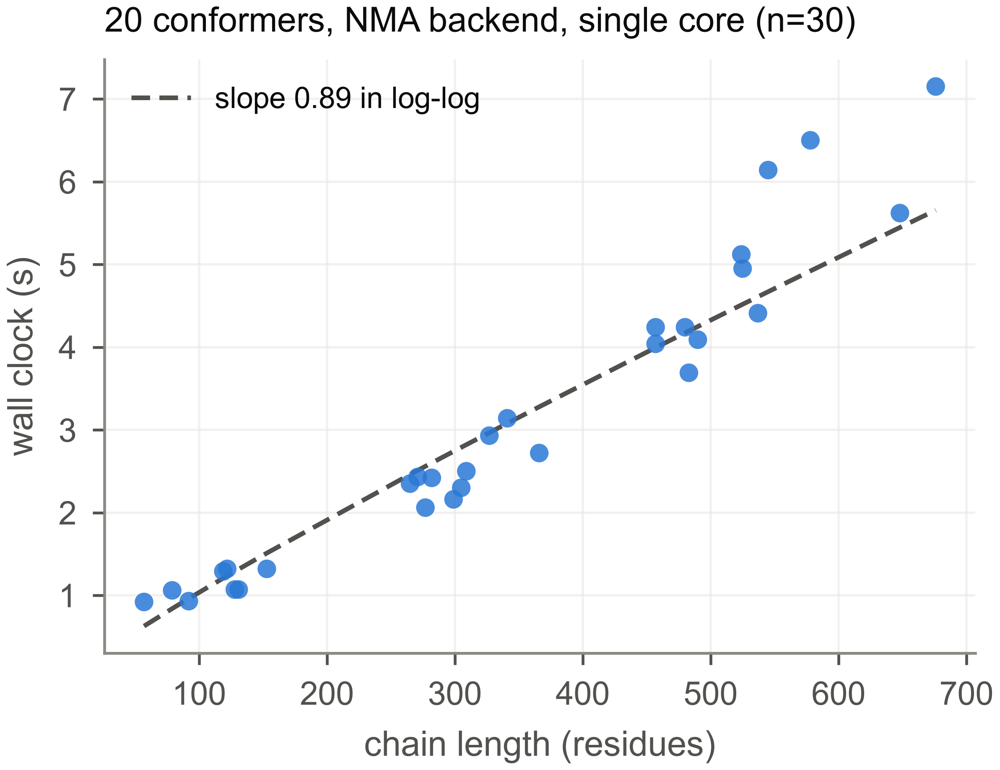

## Abstract

We introduce Lacuna, an open-source Python tool for discovering cryptic binding
pockets: sites that are absent or too small to detect in a protein's unbound
structure and open only during conformational fluctuation. Most binding-site
predictors score a single static structure, which is precisely the structure in
which a cryptic site is invisible. Lacuna instead generates a conformational
ensemble from any input structure, detects pockets independently in every
conformer, clusters the detections into persistent sites across the ensemble, and
ranks those sites with a model fitted on within-structure pairs. Ensemble
generation is pluggable: normal mode analysis by default, with implicit-solvent
molecular dynamics, Boltz-2 diffusion sampling, or a user-supplied ensemble as
alternatives. On the held-out test fold of CryptoBench, Lacuna recovers 55.6% of
cryptic sites in its top five predictions, rising to 66.1% with an optional
PLM-assisted ranker, and it recovers 73%, 45% and 87% on the PocketMiner set, a
curated set of literature apo/holo pairs, and COACH420 respectively. The default
backend completes in a median of 2.6 seconds per chain on one CPU core, so
ensemble-based pocket finding does not require a simulation budget. Every site carries a continuous
crypticity score, and outputs are emitted as docking-ready Boltz YAML
constraints, AutoDock Vina boxes and pseudoatom PDB files. Lacuna is MIT
licensed and available at https://github.com/mooreneural/lacuna and on PyPI as
`lacuna-pockets`.

## Introduction

Roughly 70% of disease-relevant human proteins have no obvious binding site in
their experimentally determined structures and are classified as undruggable
[1]. A substantial fraction of those are not truly featureless: they carry
cryptic sites, pockets that are closed in the apo structure and open on ligand
binding or thermal fluctuation [2]. K-Ras was considered undruggable for three
decades until a cryptic pocket beneath switch-II was identified, which led
directly to a clinical programme [3]. The practical question is not whether such
sites exist but whether they can be found computationally before a ligand is
known.

This is hard for a specific and structural reason. The dominant approach to
binding-site prediction scores a single static structure, whether geometrically
by identifying concave surface features [4] or by machine learning over surface
descriptors [5] or learned residue representations [6]. Applied to an apo
structure containing a cryptic site, these methods are being asked to find a
cavity that is not there. Methods built specifically for cryptic sites predict
per-residue opening propensity from a single structure [7], which sidesteps the
geometry problem but returns residue scores rather than a pocket a docking
program can accept.

The alternative is to supply the missing conformations. Molecular dynamics
followed by pocket detection on the trajectory is the established route [8], and
it works, but it places a simulation budget between the user and an answer, which
in practice restricts it to targets already considered worth the investment. That
cost is why ensemble-based pocket finding has not become routine tooling in the
way single-structure detectors have.

> **Key Problem.** A cryptic site is absent or poorly formed in the apo
> structure, so a detector given one static structure is asked to find a cavity
> that is not there. Molecular dynamics exposes the missing conformations but
> puts a simulation budget between the user and an answer, which keeps
> ensemble-based pocket finding off the default path for most targets.

Lacuna is built on the observation that the ensemble does not have to be
expensive to be useful. A cryptic pocket needs only to open somewhere in a set of
plausible conformations for a geometric detector to see it, and the cheapest
useful source of such conformations, an elastic network model, costs seconds
rather than CPU-days. What matters is then the bookkeeping: detecting pockets
per conformer produces a large, redundant set of transient cavities that must be
matched across frames into persistent sites and ordered so the interesting one
appears near the top.

Our contributions are as follows.

**Lacuna makes ensemble-based pocket discovery cheap enough to be routine.** The
default backend requires no simulation setup, no force field parameterisation and
no GPU, and completes in a median of 2.6 seconds per chain on one CPU core
(Figure 4). Users who want a more expensive ensemble can substitute one without
changing anything downstream.

**Ensemble generation is pluggable, including a co-folding backend.** Normal mode
analysis, implicit-solvent molecular dynamics, Boltz-2 diffusion sampling, and
arbitrary user-supplied ensembles all present the same interface, so the sampling
method is a parameter rather than a rewrite.

**Transient pockets are first-class objects.** Detections are clustered across
conformers into sites that carry their own statistics: how often the site is
open, how much it opens relative to the input structure, and how far its centroid
wanders. These ensemble-derived quantities are unavailable to any
single-structure detector and are what the ranker relies on most.

**Ranking is fitted, not hand-tuned.** A linear model over 23 features, trained
on within-structure pairs so that it optimises ordering directly, recovers
55.6% of CryptoBench test-fold sites against 17.8% for the analytic crypticity
rule it replaced, a factor of three (Figure 3b).

**Output is docking-ready.** Each site is emitted as a Boltz YAML constraint, an
AutoDock Vina box, and a pseudoatom PDB, so a predicted pocket can be handed
directly to a docking or co-folding run.

Lacuna is MIT licensed, distributed on PyPI, archived on Zenodo [9], and covered
by 167 tests. This report describes the design and validates the implementation.
A separate study uses Lacuna's per-candidate output, alongside three other
detectors, to analyse how the field's standard evaluation metric conflates
detection with ranking; that analysis is reported elsewhere [10] and is not
restated here.

**How to interpret these results.** Lacuna is built for cryptic-site discovery,
not general binding-site prediction, and the results below should not be read as
a claim of universal superiority. On general holo sites that are already open,
P2Rank is better, and Section 3.5 reports that result rather than omitting it. On
cryptic sites the zero-dependency default does not reach parity with P2Rank
either: it trails by 7.8 points with an interval excluding zero, and only the
optional PLM-assisted ranker reaches statistical parity. What the default buys
instead is that it runs in seconds on a CPU with no model weights, no MSA and no
GPU. The contribution is a modular ensemble-analysis system with ensemble-derived
site properties and docking-ready output, not a detector that dominates all
alternatives.



**Figure 1: The canonical cryptic pocket, recovered at rank 1 in three seconds.**
Lacuna run on chain A of apo K-Ras (PDB 4OBE) with default settings: normal mode
backend, 20 conformers. (a) Each row is a pocket cluster, each column a
conformer, and a mark indicates the cluster was detected in that conformer.
Column 0, left of the dashed line, is the input crystal structure itself; columns
1 to 20 are generated conformers. Clusters absent from the input structure are
coloured blue. The rank-1 cluster is the switch-II pocket: it is detected in 11
of the 20 generated conformers and in none of the input, which is what makes it
cryptic and what makes it invisible to a detector that sees only column 0. (b)
Pocket volume in the input structure against the peak volume reached anywhere in
the ensemble. The switch-II cluster goes from 0 to 305 ų. Clusters 2 and 4 are
ordinary surface pockets, already open in the input, and the ensemble adds little
to them. The rank-1 cluster reaches a Jaccard overlap of 0.33 with the
literature-annotated switch-II site and contains 79% of its residues.

## Design

### Overview

Lacuna is a four-stage pipeline (Figure 2). A structure enters, an ensemble is
generated, pockets are detected independently in each conformer, detections are
clustered across conformers, and the resulting sites are ranked and written out.
Each stage is separable, and the ensemble stage in particular is a plugin point.

**Ensemble generation.** The default backend is an anisotropic network model
[11], an elastic network in which residues are nodes connected by harmonic
springs. Displacing the structure along its lowest-frequency normal modes
produces conformers that respect the fold's intrinsic flexibility at negligible
cost. This is deliberately the cheapest reasonable choice, and it is also the
most limited: harmonic modes describe collective breathing well and cannot
produce large hinge motions or loop rearrangements. Three alternatives share the
same interface. An implicit-solvent molecular dynamics backend samples thermal
motion directly. A Boltz-2 backend [16] draws conformers as independent samples
from a co-folding model's learned posterior, with the diffusion step scale
lowered from its default to increase structural diversity. Finally, `--ensemble` accepts a
multi-model PDB or a directory of structures, so an ensemble produced by any
external method can be analysed without Lacuna generating anything; frames are
matched to the input by residue numbering and atom name, so a frame missing a
loop remains usable.

**Pocket detection.** Within each conformer, pockets are found by a grid-based
alpha-sphere method in the fpocket lineage [4]: candidate spheres are placed
where they contact protein atoms without penetrating them, retained within a
radius band that admits ligand-sized cavities while rejecting bulk solvent and
interstitial voids, and clustered spatially into pockets. Lining residues are
assigned by true atomic contact rather than by a radius around the pocket centre,
which matters because a centre-and-radius definition inflates the residue set of
large pockets and makes any overlap metric computed from it optimistic.
Alternative detectors are available: `--detector p2rank` substitutes P2Rank [5]
per conformer, and `fusion` runs both.

**Cross-conformer clustering.** This is the step that turns per-frame detections
into sites. Pockets from different conformers are matched into clusters by
spatial proximity of their centres together with overlap of their lining residue
sets, so that the same physical site detected in fifteen conformers becomes one
cluster rather than fifteen candidates. Each cluster then carries statistics no
single structure can provide: persistence, the fraction of conformers in which
the site is open; the volume distribution across the ensemble and its
coefficient of variation; the volume in the input structure specifically; and the
positional spread of the cluster's centroid between conformers.

**Ranking.** The default strategy is a linear model over 23 features spanning
pocket geometry, druggability in the sense of Halgren's descriptors [12], and the
ensemble-derived terms above. It is fitted on within-structure pairs, so it
optimises the ordering of candidates inside one protein rather than classifying
pockets in isolation, which is the quantity that actually determines whether a
user sees the right site. Fitting used only CryptoBench's homology-separated
training folds. An optional strategy, `learned-plm`, refits the same linear form
with four additional features summarising a protein language model's per-residue
cryptic-site probabilities over the cluster's lining [13]; it requires an
optional dependency and is not the default, so that the same command produces the
same ranking on every installation. Several analytic strategies remain available
for targets that resemble classical case studies more than they resemble
CryptoBench.

**Crypticity.** Independently of rank, every site receives a continuous score
between 0 and 1 capturing the conformational-selection signature:

```
opening    = (max_volume − input_volume) / max_volume
crypticity = opening × peak_open_state_druggability
```

A site absent from the input structure has opening 1.0, so crypticity reduces to
its druggability once open. A site already open in the input has low opening and
therefore low crypticity regardless of how druggable it is. A site is
additionally flagged cryptic when it is present in fewer than 90% of conformers.

**Outputs.** Sites are written as a ranked JSON report carrying every quantity
above, and optionally as Boltz YAML constraint files, AutoDock Vina box configs,
and pseudoatom PDB files for visualisation. The docking outputs exist because a
predicted pocket that cannot be handed to the next tool in a workflow is of
limited use.



**Figure 2: Lacuna's pipeline.** Ensemble generation is a plugin point; detection
runs independently per conformer; clustering is what converts transient
per-frame cavities into persistent sites with ensemble statistics.

### Interface

The command line covers the common case:

```bash
pip install lacuna-pockets
lacuna discover protein.pdb
lacuna discover protein.pdb --backend boltz --conformers 30
lacuna discover protein.pdb --emit-boltz-constraints --emit-vina-boxes
```

Inputs are PDB or mmCIF and may come from the PDB, AlphaFold [14], Boltz or Chai.
A `--homodimer` flag builds the biological assembly from BIOMT or
`_pdbx_struct_oper_list` records, which is required for sites at dimer
interfaces. A second command, `lacuna dock-prep`, regenerates docking inputs from
an existing pocket report, so a run does not have to be repeated to produce them.
The Python API exposes the same stages individually for users who want to
substitute a component.

Lacuna requires Python 3.10 or later. Optional extras (`lacuna[openmm]`,
`lacuna[boltz]`, `lacuna[plm]`, or `lacuna[all]`) gate the heavier dependencies,
so a base install pulls only NumPy, SciPy, BioPython and two command-line
libraries, and the default pipeline runs with no GPU and no compiled extensions.

## Validation

### A worked example

Figure 1 shows Lacuna applied to apo K-Ras (PDB 4OBE, chain A) at default
settings. The switch-II pocket is returned at rank 1, with a Jaccard overlap of
0.33 against the literature-annotated site and 79% of its annotated residues
recovered. The run took 3.1 seconds.

The mechanism is visible in the figure rather than asserted. The switch-II
cluster has zero volume in the input crystal structure and reaches 305 ų at its
widest in the ensemble, and it is detected in 11 of 20 generated conformers.
A detector restricted to column 0 has nothing to find. This example is a
favourable one, chosen because it is the canonical case; the aggregate behaviour
is in the next section.

### Recovery across four datasets

A site counts as recovered when, among the top five ranked clusters, one reaches
a Jaccard overlap of at least 0.25 with the known ligand-contact residues, or its
centre lies within 4 Å of the site centroid. Jaccard is used rather than plain
recall because recall is size-gameable: a sufficiently large pocket engulfs most
of a small known site without being localised on it.

The size of that effect is worth stating, because it determines whether the
criterion is doing any work. Ordering the same candidate set by pocket volume
alone, using no learned model and no other feature, recovers 77.7% of test-fold
structures under a recall threshold of 0.30 but only 52.0% under Jaccard at 0.25.
The learned ranker scores 77.7% under recall as well: measured that way it is
indistinguishable from sorting by size, and the two separate only under Jaccard,
at 55.9% against 52.0%. A metric on which a trained model cannot be told apart
from a volume sort is not measuring localisation, which is why every number below
uses Jaccard. These figures come from `benchmarks/verify_recall_gaming.py`, which
recovers recall exactly from the stored Jaccard and lining size; they cover the
Jaccard term of the criterion only, on the 179 test-fold structures whose
annotated site size is recoverable, so they sit slightly above the headline
figures that also apply the centroid clause.

**Cohort note.** Evaluation here uses all 180 CryptoBench test-fold structures.
The companion detector-comparison study [10] uses the 178 on which all four
methods it compares produced output, so that every comparison there is paired.
The PLM-assisted ranker therefore scores 66.1% (119/180) in this report and
66.3% on that paired 178-structure cohort. The two are the same configuration
measured on slightly different sets, not a change in the software.

Figure 3 reports recovery on four datasets. On the held-out CryptoBench test
fold [15], the largest and most diverse cryptic-site benchmark, the default
ranker recovers 55.6% and the optional PLM-assisted ranker 66.1%. Independent
validation is consistent: 73% (33/45) on the PocketMiner set [7] and 45% (10/22)
on a curated set of apo/holo pairs assembled from the cryptic-pocket literature
[2]. The CryptoBench split follows the dataset's own homology-separated folds and
the ranker was fitted on training folds only, so the test fold is genuinely
unseen.

How much of that comes from ordering rather than detection is separable, because
the ranking strategy can be changed without touching the pipeline that produces
the candidates. Figure 3b holds the candidate set fixed and varies only the
ordering. The analytic crypticity rule that was the default before v1.0.0
recovers 17.8% of the test fold; the fitted linear model recovers 55.6% from the
same candidates, and the PLM-assisted variant 66.1%. The detector was already
proposing the right pocket for most of the targets the analytic rule missed, and
was burying it. This is the single largest effect measured in this report, and it
required no change to sampling or detection.

The most informative comparison is against MDpocket [8], which is the
established route to the same goal: detect pockets on an ensemble and aggregate
across it. Handing MDpocket the identical normal-mode ensemble Lacuna generates
isolates the analysis pipeline from the sampler, since both then see exactly the
same conformations. On that footing MDpocket recovers 43.9% of the test fold,
against 55.6% for Lacuna's default ranker (+11.7%, 95% CI +3.9 to +19.4) and
66.1% with the PLM-assisted ranker (+22.2%, CI +14.4 to +30.0). MDpocket is reported
at its best of ten configurations, with both isovalue and ranking rule swept in
its favour; at its default isovalue it scores 40.2%. Because the sampling is held
constant, the difference is attributable to the clustering and ranking stages,
which is where this tool's contribution lies.

The fourth dataset is a deliberate negative control. COACH420 contains holo
structures whose pocket is already open, which is an easier task and not the one
Lacuna is built for. Lacuna scores 86.8% there with the default ranker, but
paired on the same 144 structures P2Rank scores 93.8%, a difference of −6.9%
(95% CI −12.5 to −1.4) that excludes zero.

On cryptic sites the ordering against P2Rank depends on configuration, and it is
worth stating precisely rather than summarising. The optional PLM-assisted ranker
reaches parity, nominally ahead by 2.8 points but with an interval spanning zero
(CI −4.4 to +9.4), so parity is the honest word and not a win. The
zero-dependency default does not reach parity: at 55.6% it trails P2Rank by 7.8
points, with an interval that excludes zero (CI −15.0 to −0.6). The higher
absolute number on COACH420 reflects the easier task rather than better
performance, and cross-dataset comparison of these figures is not meaningful.



**Figure 3: Recovery in the top five predictions, and what ordering contributes.**
A site counts as recovered at Jaccard ≥ 0.25 against known ligand-contact
residues, or a centroid within 4 Å. (a) Four datasets. `learned` is the default
ranker and needs only a base install; `learned-plm` additionally requires a
protein language model and was not measured on COACH420. COACH420 holds general,
already-open binding sites rather than cryptic ones and is included as a control,
not as a headline: the task is easier, and a general-purpose detector beats
Lacuna on it. (b) Ranking-strategy ablation on the CryptoBench test fold, holding
the candidate set fixed so that only the ordering changes. The analytic
crypticity rule that served as the pre-1.0 default recovers 17.8%, the fitted
linear model 55.6%, and the PLM-assisted variant 66.1%. Detection did not change
between these three bars, which is the point: the candidates were already being
generated and were being ordered badly.

### Runtime

Figure 4 reports wall-clock time against chain length for the default backend at
20 conformers on a single core. Each structure is a single extracted chain,
timed in a separate process so that interpreter warm-up cannot flatter later
runs, drawn across the CryptoBench size range rather than cherry-picked.

Across 30 chains spanning 57 to 676 residues, the complete pipeline, ensemble
generation through ranking, takes 0.9 to 7.2 seconds, with a median of 2.6. A
power-law fit gives an exponent of 0.89, so cost is essentially linear in chain
length over this range. The K-Ras example in Figure 1 took 3.1 seconds.

The practical consequence is that ensemble-based pocket discovery on a single
protein is an interactive operation rather than a scheduled job, which is the
design goal. The heavier backends are correspondingly more expensive: the
molecular dynamics and Boltz-2 backends cost minutes to hours per target and are
appropriate when the default's harmonic sampling is known to be insufficient.



**Figure 4: Wall clock against chain length.** Default normal mode backend, 20
conformers, single core, single extracted chain per structure, drawn across the
CryptoBench size range rather than cherry-picked. The dashed line is a power-law
fit in log-log coordinates.

## Conclusions

Lacuna packages ensemble-based cryptic pocket discovery as a tool that installs
with pip and runs in seconds, rather than as a protocol requiring a simulation
budget. Its distinguishing choices are that the ensemble backend is a swappable
parameter, that detections are clustered across conformers into sites carrying
ensemble statistics, and that ranking those sites is a fitted problem rather than
a hand-designed rule.

### Limitations

Two limits are worth stating plainly.

The first is ranking. Across the candidate set Lacuna generates, some cluster
clears the recovery criterion for 73.7% of CryptoBench test-fold structures,
against the 66.1% that reach the top five. The site is often found and then
out-ranked. Several attempts to close that gap returned nothing measurable:
spatial non-maximum suppression, merging adjacent sub-pockets, hard-negative
mining, gradient boosting in place of the linear model, and importing P2Rank's
own per-pocket confidence as a ranking feature. The last is the most informative,
since if per-point scoring were the missing ingredient then handing the ranker
P2Rank's opinion directly should have helped, and it did not.

The second is sampling. Stratifying the test fold by how far the site moves
between apo and holo, Lacuna recovers 47% of the most-mobile quartile against
P2Rank's 62%. The default elastic network is harmonic and cannot generate large
hinge or interface openings. Enhanced-temperature dynamics, metadynamics along an
apo-derived collective variable, and scaled-water dynamics were each null against
baseline at single-workstation sampling. Catching those events reliably appears
to need tens to hundreds of nanoseconds across dozens of replicas per target,
which is a cluster-scale cost rather than a missing algorithm. This is the gap
the co-folding backend is intended to probe, since a generative model samples
conformational diversity without paying for the trajectory between states.

## Data and code availability

Source code is at https://github.com/mooreneural/lacuna under the MIT licence,
released as v1.0.0 and installable as `pip install lacuna-pockets`. The exact
version described here is archived on Zenodo at doi:10.5281/zenodo.21891171 [9]. All benchmark scripts,
including those that produce every number in Figure 3, are in the repository's
`benchmarks/` directory and download their datasets automatically.

## References

1. Dang CV, Reddy EP, Shokat KM, Soucek L. Drugging the 'undruggable' cancer
   targets. *Nature Reviews Cancer* 2017. doi:10.1038/nrc.2017.36

2. Cimermancic P, Weinkam P, Rettenmaier TJ, Bichmann L, Heffron GJ, Rakoczy S,
   et al. CryptoSite: expanding the druggable proteome by characterization and
   prediction of cryptic binding sites. *Journal of Molecular Biology*
   2016;**428**(4):709-719. doi:10.1016/j.jmb.2016.01.029

3. Ostrem JM, Peters U, Sos ML, Wells JA, Shokat KM. K-Ras(G12C) inhibitors
   allosterically control GTP affinity and effector interactions. *Nature*
   2013;**503**:548-551. doi:10.1038/nature12796

4. Le Guilloux V, Schmidtke P, Tuffery P. Fpocket: an open source platform for
   ligand pocket detection. *BMC Bioinformatics* 2009;**10**:168.
   doi:10.1186/1471-2105-10-168

5. Krivák R, Hoksza D. P2Rank: machine learning based tool for rapid and accurate
   prediction of ligand binding sites from protein structure. *Journal of
   Cheminformatics* 2018;**10**:39. doi:10.1186/s13321-018-0285-8

6. Carbery A, Buttenschoen M, Skyner R, von Delft F, Deane CM. Learnt
   representations of proteins can be used for accurate prediction of small
   molecule binding sites on experimentally determined and predicted protein
   structures. *Journal of Cheminformatics* 2024;**16**:32.
   doi:10.1186/s13321-024-00821-4

7. Meller A, Ward M, Borowsky J, Kshirsagar M, Lotthammer JM, Oviedo F, et al.
   Predicting locations of cryptic pockets from single protein structures using
   the PocketMiner graph neural network. *Nature Communications* 2023;**14**:1177.
   doi:10.1038/s41467-023-36699-3

8. Schmidtke P, Bidon-Chanal A, Luque FJ, Barril X. MDpocket: open-source cavity
   detection and characterization on molecular dynamics trajectories.
   *Bioinformatics* 2011. doi:10.1093/bioinformatics/btr550

9. Moore CW. Lacuna: cryptic binding pocket discovery via conformational ensemble
   analysis (v1.0.0). Zenodo, 2026. doi:10.5281/zenodo.21891171

10. Moore CW. Cryptic binding sites are detected but not ranked: coverage,
    conversion, and detector consensus. *Preprint* 2026.

11. Atilgan AR, Durell SR, Jernigan RL, Demirel MC, Keskin O, Bahar I. Anisotropy
    of fluctuation dynamics of proteins with an elastic network model.
    *Biophysical Journal* 2001. doi:10.1016/S0006-3495(01)76033-X

12. Halgren TA. Identifying and characterizing binding sites and assessing
    druggability. *Journal of Chemical Information and Modeling* 2009.
    doi:10.1021/ci800324m

13. Lin Z, Akin H, Rao R, Hie B, Zhu Z, Lu W, et al. Evolutionary-scale
    prediction of atomic-level protein structure with a language model. *Science*
    2023;**379**(6637):1123-1130. doi:10.1126/science.ade2574

14. Jumper J, Evans R, Pritzel A, Green T, Figurnov M, Ronneberger O, et al.
    Highly accurate protein structure prediction with AlphaFold. *Nature* 2021.
    doi:10.1038/s41586-021-03819-2

15. Škrhák V, Novotný M, Feidakis C, Krivák R, Hoksza D. CryptoBench: cryptic
    protein-ligand binding sites dataset and benchmark. *Bioinformatics*
    2025;**41**(1):btae745. doi:10.1093/bioinformatics/btae745

16. Passaro S, Corso G, Wohlwend J, Reveiz M, Thaler S, Somnath VR, et al.
    Boltz-2: towards accurate and efficient binding affinity prediction.
    *bioRxiv* 2025. doi:10.1101/2025.06.14.659707
